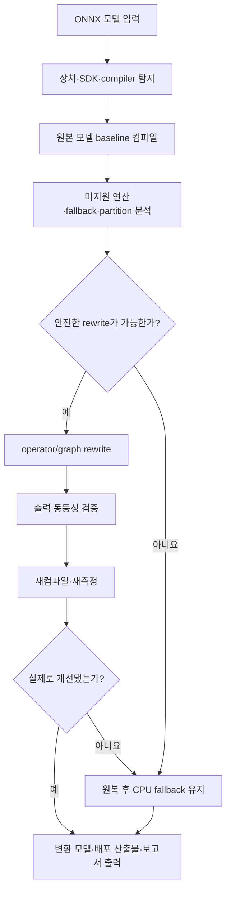

# ARONA

**Accelerator-aware Rewriting and Operator-compatible Neural Adaptation**  
가속기 인지형 연산자 변환 및 신경망 적응

> 대상 엣지 장치 또는 장치에 연결된 개발 PC에서 하드웨어와 컴파일러를 자동으로 인식하고, ONNX 모델의 미지원 연산과 CPU fallback을 줄이도록 그래프를 재작성하는 로컬 최적화 도구

> [!NOTE]
> 현재 저장소는 MVP 설계 및 초기 개발 단계입니다. 아래 기능은 2026년 8월 27일 18:00 제출을 목표로 구현할 범위를 설명합니다.

## 문제 정의

GPU에서 정상적으로 실행되는 모델도 엣지 NPU에서는 다음과 같은 이유로 일부 또는 전체가 가속되지 않을 수 있습니다.

- 대상 가속기가 모델의 연산자를 지원하지 않음
- 연산자는 지원하지만 shape, layout, datatype 또는 attribute 제약을 위반함
- 미지원 연산이 CPU fallback을 발생시킴
- 모델이 여러 NPU/CPU subgraph로 분할되어 tensor 전송 비용이 증가함
- 개별 연산자는 지원되지만 compiler fusion이나 정렬 조건을 만족하지 못함

제조사 compiler는 일반적으로 지원되는 구간을 가속기에 배치하고 나머지를 CPU에 남깁니다. ARONA는 그 앞단에서 compiler 결과를 분석하고, 미지원·비효율 구간을 가속기 친화적인 연산 그래프로 재작성한 뒤 다시 컴파일하여 실제 개선 여부를 확인합니다.

## MVP 목표

사용자는 대상 제조사의 변환 명령을 직접 구성하지 않고 ONNX 모델 하나를 입력합니다.

```bash
arona optimize model.onnx
```

ARONA는 실행 중인 엣지 장치 또는 연결된 개발 환경에서 사용 가능한 장치, SDK, runtime 및 compiler를 탐지하고 다음 과정을 수행합니다.



ARONA의 목표는 CPU fallback을 무조건 제거하는 것이 아닙니다. rewrite가 정확도, latency 또는 전송 비용 측면에서 불리하다면 기존 CPU fallback을 유지하고 그 근거를 보고합니다.

## 실행 환경

ARONA는 다음 두 환경을 지원하는 구조로 개발합니다.

1. **On-device**: ARONA를 엣지 장치에서 직접 실행
2. **Host-connected**: vendor SDK/compiler가 설치된 개발 PC에서 연결된 엣지 장치를 대상으로 실행

사용자가 target을 매번 지정하는 방식이 아니라 현재 환경을 자동 탐지하는 것을 기본으로 합니다. 여러 장치가 발견되거나 자동 탐지가 실패한 경우에만 target override를 사용합니다.

```bash
arona optimize model.onnx --target <backend-name>
```

## 최적화 의사결정

각 문제 연산 또는 subgraph는 다음 순서로 처리합니다.

1. **Native execution**: 대상 가속기에서 그대로 실행
2. **Exact rewrite**: 의미적으로 동등한 지원 연산자 조합으로 치환
3. **Neural adaptation**: 데이터가 있을 때 근사 구조로 치환하고 fine-tuning 또는 distillation 수행
4. **CPU fallback**: 안전한 변환이 없거나 변환 이득이 없으면 해당 구간만 CPU에 유지

예를 들어 대상 가속기가 `SiLU`는 지원하지 않지만 `Sigmoid`와 `Mul`을 지원한다면 다음과 같은 exact rewrite 후보를 적용할 수 있습니다.

```text
SiLU(x)  →  x * Sigmoid(x)
```

rewrite는 대체 그래프의 모든 연산자가 현재 장치에서 지원되고, 출력 동등성 검증을 통과한 경우에만 채택합니다.

CPU fallback 여부는 노드 개수만으로 판단하지 않습니다. 다음 정보를 함께 비교합니다.

- 가속기에서 실행되는 subgraph 비율
- NPU/CPU partition 수
- NPU와 CPU 사이의 전환 횟수
- 경계 tensor의 shape와 예상 전송량
- rewrite로 추가되는 연산 비용
- 원본 대비 출력 오차 또는 task accuracy 변화
- 실제 compiler의 성공 여부와 profiling 결과

## MVP 범위

### 필수 기능

- ONNX 모델 입력, 유효성 검사 및 shape inference
- 현재 장치, SDK, runtime 및 compiler 자동 탐지
- 원본 모델 baseline 컴파일
- compiler 로그에서 미지원 노드, CPU fallback 및 graph partition 추출
- ONNX graph node와 compiler 분석 결과 연결
- exact operator/graph rewrite 최소 2개
- rewrite 후 자동 재컴파일 및 결과 비교
- ONNX Runtime 기반 출력 동등성 검증
- 개선되지 않은 rewrite의 자동 원복
- 변환할 수 없는 구간의 CPU fallback 표시
- 원본/변환 모델의 호환성 및 성능 비교 보고서
- CLI와 간단한 로컬 웹 UI
- 공통 `BackendAdapter` 인터페이스
- 실제 엣지 가속기용 backend adapter 최소 1개

### 시간이 허용되면 포함

- 근사 operator replacement 1개
- calibration 또는 fine-tuning을 통한 정확도 복구
- 실제 장치 latency와 peak memory 측정
- 두 번째 backend용 예제 adapter

선택 기능은 필수 기능의 end-to-end pipeline이 안정화된 뒤에만 착수합니다.

## 출력 산출물

최적화 실행 결과는 다음을 포함합니다.

```text
outputs/<run-id>/
├── original-analysis.json
├── optimized-model.onnx
├── optimized-analysis.json
├── rewrite-history.json
├── compiler/
├── validation.json
└── report.html
```

- 최적화된 ONNX 모델
- backend가 생성한 배포용 산출물
- 미지원 연산 및 backend 배치 결과
- CPU fallback과 graph partition 정보
- 적용·거절·원복된 rewrite 이력과 사유
- 출력 동등성 검증 결과
- 원본 대비 latency 및 memory 결과(측정 가능한 경우)
- 재현에 필요한 장치, SDK, compiler 및 설정 정보

## 기술 스택

| 영역 | 언어·도구 |
| --- | --- |
| 주 언어 | Python 3.11+ |
| 모델 그래프 | ONNX, ONNX Runtime, NumPy |
| 선택적 신경망 적응 | PyTorch |
| CLI | Typer |
| 설정·스키마 | Pydantic, YAML/JSON |
| 로컬 UI | Streamlit |
| 시각화 | Plotly |
| 테스트 | pytest |
| 코드 품질 | Ruff, pre-commit |
| 하드웨어 연동 | vendor SDK/compiler를 호출하는 backend adapter |

## 라이선스

이 프로젝트는 [MIT License](LICENSE)를 따릅니다.
