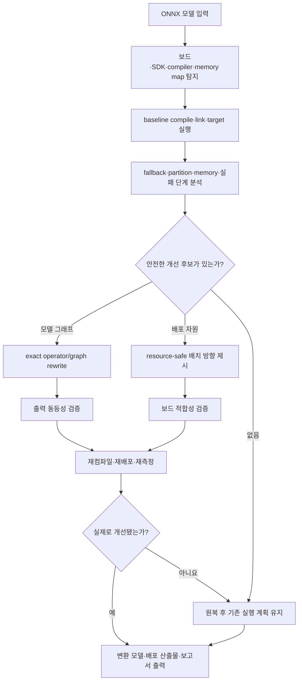

# ARONA

**Accelerator-aware Rewriting and Operator-compatible Neural Adaptation**  
가속기 인지형 연산자 변환 및 신경망 적응

> 대상 엣지 장치 또는 장치에 연결된 개발 PC에서 하드웨어와 컴파일러를 자동으로 인식하고, ONNX 모델의 미지원 연산·CPU fallback·메모리 및 배포 제약을 분석해 안전한 최적화 방안을 적용하는 로컬 도구

> [!NOTE]
> 현재 저장소는 MVP 설계 및 초기 개발 단계입니다. 아래 기능은 2026년 8월 27일 18:00 제출을 목표로 구현할 범위를 설명합니다.

## 문제 정의

GPU에서 정상적으로 실행되는 모델도 엣지 NPU에서는 다음과 같은 이유로 일부 또는 전체가 가속되지 않을 수 있습니다.

- 대상 가속기가 모델의 연산자를 지원하지 않음
- 연산자는 지원하지만 shape, layout, datatype 또는 attribute 제약을 위반함
- 미지원 연산이 CPU fallback을 발생시킴
- 모델이 여러 NPU/CPU subgraph로 분할되어 tensor 전송 비용이 증가함
- 개별 연산자는 지원되지만 compiler fusion이나 정렬 조건을 만족하지 못함
- compiler memory profile이 실제 보드에 없는 RAM을 사용하거나, 필요한 연속 activation buffer를 확보하지 못함
- 모델 weight, activation, application code 및 runtime이 같은 SRAM 영역을 두고 경쟁함
- 모델 compile에는 성공했지만 link, image signing, programming, device initialization 또는 inference 단계에서 실패함

제조사 compiler는 일반적으로 지원되는 구간을 가속기에 배치하고 나머지를 CPU에 남깁니다. ARONA는 compiler 결과와 실제 보드 자원을 함께 분석하고, 문제 원인이 모델 그래프인지 배포 환경인지 구분합니다. 모델 문제에는 가속기 친화적인 graph rewrite를 적용하고, 자원 문제에는 유효한 memory placement 방향을 제시한 뒤 재컴파일과 target validation으로 실제 개선 여부를 확인합니다.

## MVP 목표

사용자는 대상 제조사의 변환 명령을 직접 구성하지 않고 ONNX 모델 하나를 입력합니다.

```bash
arona optimize model.onnx
```

ARONA는 실행 중인 엣지 장치 또는 연결된 개발 환경에서 사용 가능한 장치, SDK, runtime 및 compiler를 탐지하고 다음 과정을 수행합니다.



ARONA의 목표는 CPU fallback을 무조건 제거하는 것이 아닙니다. rewrite가 정확도, latency 또는 전송 비용 측면에서 불리하다면 기존 CPU fallback을 유지하고 그 근거를 보고합니다.

## 실행 환경

ARONA는 다음 두 환경을 지원하는 구조로 개발합니다.

1. **On-device**: ARONA를 엣지 장치에서 직접 실행
2. **Host-connected**: vendor SDK/compiler가 설치된 개발 PC에서 연결된 엣지 장치를 대상으로 실행

사용자가 target을 매번 지정하는 방식이 아니라 현재 환경을 자동 탐지하는 것을 기본으로 합니다. 여러 장치가 발견되거나 자동 탐지가 실패한 경우에만 target override를 사용합니다.

```bash
arona optimize model.onnx --target <backend-name>
```

## 최적화 의사결정

각 문제 연산 또는 subgraph는 다음 순서로 처리합니다.

1. **Native execution**: 대상 가속기에서 그대로 실행
2. **Exact rewrite**: 의미적으로 동등한 지원 연산자 조합으로 치환
3. **Neural adaptation**: 데이터가 있을 때 근사 구조로 치환하고 fine-tuning 또는 distillation 수행
4. **CPU fallback**: 안전한 변환이 없거나 변환 이득이 없으면 해당 구간만 CPU에 유지

예를 들어 대상 가속기가 `SiLU`는 지원하지 않지만 `Sigmoid`와 `Mul`을 지원한다면 다음과 같은 exact rewrite 후보를 적용할 수 있습니다.

```text
SiLU(x)  →  x * Sigmoid(x)
```

rewrite는 대체 그래프의 모든 연산자가 현재 장치에서 지원되고, 출력 동등성 검증을 통과한 경우에만 채택합니다.

CPU fallback 여부는 노드 개수만으로 판단하지 않습니다. 다음 정보를 함께 비교합니다.

- 가속기에서 실행되는 subgraph 비율
- NPU/CPU partition 수
- NPU와 CPU 사이의 전환 횟수
- 경계 tensor의 shape와 예상 전송량
- rewrite로 추가되는 연산 비용
- 원본 대비 출력 오차 또는 task accuracy 변화
- 실제 compiler의 성공 여부와 profiling 결과

## MVP 범위

### 필수 기능

- ONNX 모델 입력, 유효성 검사 및 shape inference
- 현재 장치, SDK, runtime 및 compiler 자동 탐지
- NUCLEO-N657X0-Q board profile과 실제 memory map 검사
- 원본 모델 baseline compile, link 및 target validation 단계 기록
- compiler 로그에서 미지원 노드, CPU fallback 및 graph partition 추출
- ONNX graph node와 compiler 분석 결과 연결
- 실패를 parse, optimize, partition, codegen, memory scheduling, link, signing, programming, initialization, inference 및 validation 단계로 분류
- compiler memory pool과 실제 보드 memory region의 존재 여부, 범위 및 중첩 검사
- weight, activation, application code, `.rodata`, `.data`, `.bss`, heap 및 stack의 storage class별 배치 분석
- total/CPU/NPU activation, 가장 큰 연속 buffer 및 memory bank별 사용량 보고
- 실제 target latency와 compiler가 보고한 memory 사용량 수집
- exact operator/graph rewrite 최소 2개
- rewrite 후 자동 재컴파일·target validation 및 결과 비교
- ONNX Runtime 기반 출력 동등성 검증
- 개선되지 않은 rewrite의 자동 원복
- 변환할 수 없는 구간의 CPU fallback 표시
- 원본/변환 모델의 호환성, 자원 적합성 및 성능 비교 보고서
- 일관된 진행 상태·오류·요약을 제공하는 터미널 CLI
- 공통 `BackendAdapter` 인터페이스
- ST Neural-ART용 `stedgeai` backend adapter

### 시간이 허용되면 포함

- 근사 operator replacement 1개
- calibration 또는 fine-tuning을 통한 정확도 복구
- runtime peak memory 계측(보드와 runtime이 지원하는 경우)
- 두 번째 backend용 예제 adapter

선택 기능은 필수 기능의 end-to-end pipeline이 안정화된 뒤에만 착수합니다.

## 출력 산출물

최적화 실행 결과는 다음을 포함합니다.

```text
outputs/<run-id>/
├── original-analysis.json
├── resource-analysis.json
├── deployment-analysis.json
├── optimized-model.onnx
├── optimized-analysis.json
├── rewrite-history.json
├── compiler/
├── validation.json
└── report.md
```

- 최적화된 ONNX 모델
- backend가 생성한 배포용 산출물
- 미지원 연산 및 backend 배치 결과
- CPU fallback과 graph partition 정보
- 실제 보드 memory map과 compiler memory pool의 적합성
- storage class별 배치, activation peak 및 가장 큰 연속 buffer
- compile부터 target validation까지 단계별 상태와 최초 오류
- 적용·거절·원복된 rewrite 이력과 사유
- 출력 동등성 검증 결과
- 원본 대비 latency 및 memory 결과(측정 가능한 경우)
- 재현에 필요한 장치, SDK, compiler 및 설정 정보

## 기술 스택

| 영역 | 언어·도구 |
| --- | --- |
| 주 언어 | Python 3.11+ |
| 모델 그래프 | ONNX, ONNX Runtime, NumPy |
| 선택적 신경망 적응 | PyTorch |
| CLI | Typer |
| 설정·스키마 | Pydantic, YAML/JSON |
| 사용자 인터페이스 | Typer 기반 terminal CLI |
| 보고서 | JSON, Markdown 및 terminal table |
| 테스트 | pytest |
| 코드 품질 | Ruff, pre-commit |
| 하드웨어 연동 | vendor SDK/compiler를 호출하는 backend adapter |
| MVP backend | ST Edge AI Core / `stedgeai`, STM32Cube toolchain, ST-LINK |

## MVP primary backend

Sprint 0의 primary target은 **ST NUCLEO-N657X0-Q의 Neural-ART accelerator**이며,
`stedgeai` CLI를 첫 `BackendAdapter`로 구현합니다. 실제 연구실 개발 PC에 설치된 compiler,
SDK, ST-LINK firmware 버전은 baseline compile을 재현한 뒤 고정합니다. 결정과 증거 보관
규칙은 [ST Edge AI backend 문서](docs/backends/stedgeai.md)에 기록합니다.

### Sprint 0에서 확보한 재현 근거

ConMamba 기반 ONNX 모델의 Neural-ART 배포 사례에서 다음을 확인했습니다.

- 모델 compile에 성공해도 전체 2,072개 실행 epoch 중 1,530개가 Cortex-M55 software fallback으로 배치될 수 있음
- 최초 탑재 실패 원인이 미지원 연산이 아니라 잘못된 board memory profile, linker 배치 및 외부 Flash 설정일 수 있음
- 존재하지 않는 HyperRAM을 제거한 뒤에는 application code와 activation의 SRAM 경쟁이 직접적인 제약이 됨
- 원본 모델을 바꾸지 않고 code·constant를 외부 Flash XIP로 옮겨 activation용 내부 SRAM을 확보하면 target validation에 성공할 수 있음

따라서 ARONA는 `compile succeeded`와 `deployable on the actual board`를 별도 상태로 관리하고,
operator placement와 hardware resource feasibility를 함께 분석합니다.

## Sprint 1~4 계획

| 스프린트 | 기간 | 핵심 목표 | 종료 조건 |
| --- | --- | --- | --- |
| Sprint 1 | 8/1~8/7 | Neural-ART baseline·ONNX frontend·resource/deployment 계약 고정 | 실제 toolchain과 ConMamba 재현 fixture를 기준으로 장치 탐지, ONNX 분석 및 단계·메모리 schema가 테스트를 통과함 |
| Sprint 2 | 8/8~8/14 | `stedgeai` adapter와 fallback·partition·memory·실패 단계 분석 | baseline compile 결과에서 software epoch와 memory pool을 추출하고 실제 NUCLEO memory map 불일치 및 실패 단계를 진단함 |
| Sprint 3 | 8/15~8/21 | exact rewrite 2종과 compiler-in-the-loop 검증·원복 | rewrite 후보를 ONNX Runtime으로 검증하고 재컴파일·target 측정 후 개선된 후보만 채택함 |
| Sprint 4 | 8/22~8/27 | terminal UX·통합 보고서·실기기 회귀 검증·릴리스 | 깨끗한 환경에서 CLI 데모를 재현하고 8/27 18:00 전에 release와 제출물을 확정함 |

세부 작업, 담당 분배, 주간 gate와 완료 조건은 [Sprint 계획](docs/SPRINT_PLAN.md)에 정리합니다.

## 개발 시작

Python과 오픈소스 패키지는 `uv`와 `uv.lock`으로 관리합니다.

```bash
uv sync
uv run arona --help
uv run pytest
```

backend, pipeline과 CLI/reporting이 공유하는 Pydantic 계약은 `src/arona/contracts/v1.py`, 생성된 JSON Schema는
`schemas/v0.1.0/`에 있습니다.

```bash
uv run arona schema export
```

환경 구성, 품질 검사 및 의존성 갱신 방법은 [개발 문서](docs/development.md), 계약의 의미와
호환성 정책은 [실행 결과 JSON 계약](docs/contracts/backend-cli.md), 직접 의존성의 역할과
현재 잠금 버전은 [의존성 목록](docs/dependencies.md)을 참고합니다.

## 라이선스

이 프로젝트는 [MIT License](LICENSE)를 따릅니다.
